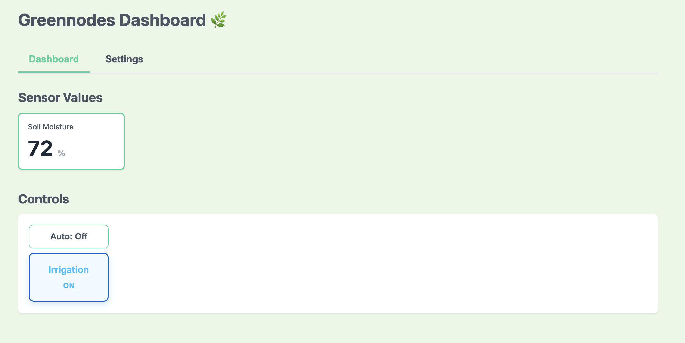
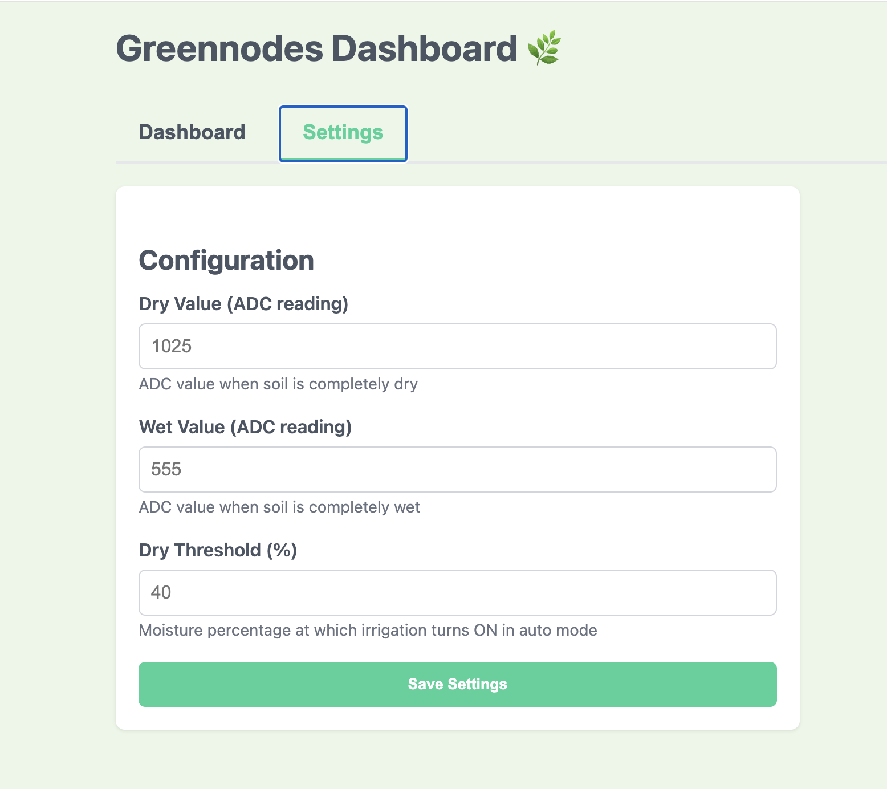
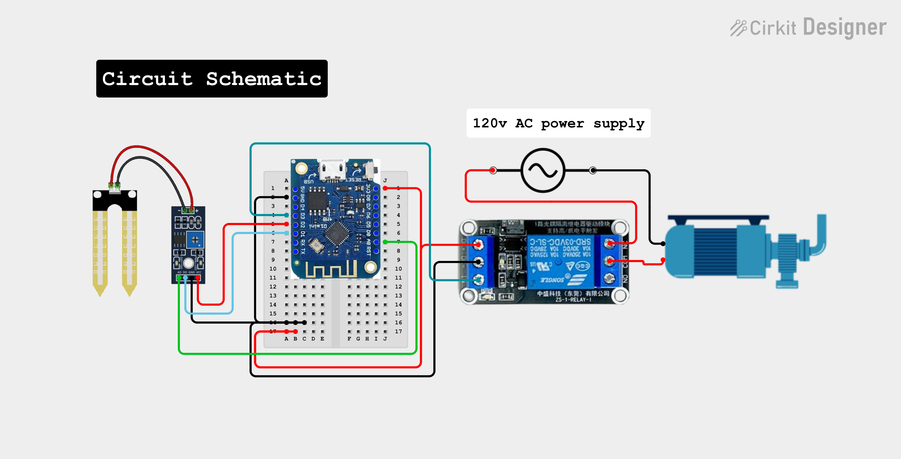
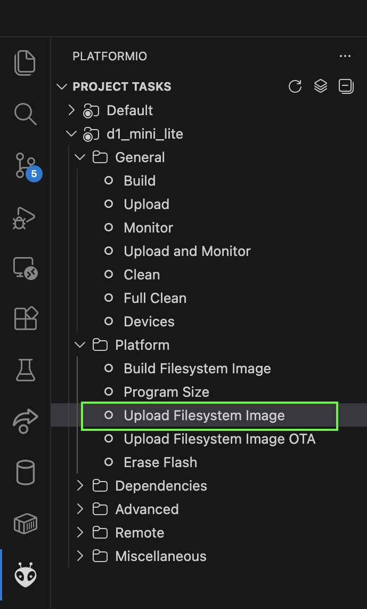

# Greennodes Basic - Captive Portal


## Prerequisites
- Platformio 
- ESP8266 knowledge

## Key Features:
✅ **Captive Portal:**

- AP mode with WiFi SSID: "Greennodes"
- Password: "greennodes123"
- Automatic redirect to dashboard when you connect
- DNS hijacking to redirect all traffic to the portal

✅ **Web Dashboard with Two Tabs:**

- Dashboard Tab: Real-time sensor, mode toggle, irrigation control

- Settings Tab: Configure dry/wet values and dry threshold


✅ **Auto & Manual Modes:**

- Auto mode: Automatically controls irrigation based on moisture
- Manual mode: User controls via button
- Auto mode disables manual button

✅ **Configuration Management:**

- Settings saved to LittleFS as JSON
- Loaded at startup
- Modified through web interface
- Persistent storage

✅ **LittleFS File System:**

- Stores config.json with all settings
- Settings persist across power cycles
- Easy to update without re-flashing code

## Tech Stack

**Frontend:** HTML, JavaScript, CSS (All the frontend is generated by the backend using C++)

**Backend:** C++

**Electronics:** 
- Development board WeMos D1 mini clone
- Relay
- YL-69 moisture sensor
- 120V AC water pump

## Circuit schematic


## How to Use:
1. Clone the project

```bash
  git clone https://github.com/localhost-5555/greennodes-basic.git
```

2. Follow the circuit schematic to do the wiring.

⚠️ **Safety Warning:** This project involves 120V AC power. Only proceed if you're experienced with high-voltage wiring, or consult a professional electrician.

3. Upload the sketch to the development board

4. Upload the static files to LittleFS using Upload Filesystem Image option from platformio



Once the uploading process has finished it shows a success message on the terminal


5. Connect to the Portal:

- Connect your phone/computer to WiFi: "Greennodes"
- Password: "greennodes123"
- Open browser (should auto-redirect to http://192.168.4.1)
- Manual access: http://192.168.4.1

### Configuration Steps
It is possible to configure the moisture sensor parameter on the Settings tab:

- Go to "Settings" tab
- Adjust dry value, wet value, and dry threshold
- Click "Save Settings" (saved to LittleFS), settings persist and don't require re-flashing.